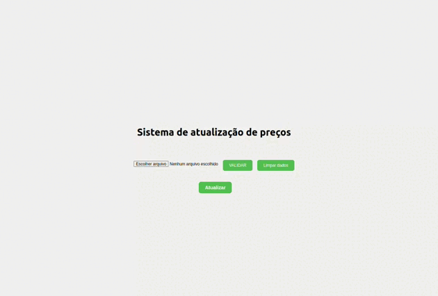

# 💲⚙️ 📊 - Price Update System

<div align="center">
  


</div> 

## :memo: Descrição
<p> O Price Update System é uma aplicação desenvolvida em Node.js com Express.js no backend e React no frontend. O objetivo da aplicação é permitir a validação e atualização de preços de produtos a partir de um arquivo CSV anexado no frontend, possibilitando uma atualização em massa.
</p>

## 🔍 Funcionalidades 
- Funcionalidades
- Validação de arquivo CSV contendo códigos de produtos e novos preços.
- Atualização dos preços dos produtos no banco de dados.
- Exibição de todos os produtos e seus respectivos preços, incluindo quantidade em pack e preço total do pack.
- Exibição de mensgem de erro quando algum produto não teve seu preço atualizado.
 
##  💻 Instalação
- Certifique-se de ter o Node.js instalado em seu sistema.
- Faça o clone deste repositório para o seu ambiente local.
- Navegue até o diretório raiz do projeto.
- Execute o comando npm install para instalar as dependências do projeto na pasta backend e na pasta frontend.

## ⚙️ Configurações
<p>Esta aplicação utiliza o docker-compose para trabalhar com o banco de dados Mysql. Após o clone da aplicação, verifique se o arquivo docker-compose.yml está presente.</> 
<p>Abra o arquivo docker-compose.yml em um editor de texto e certifique-se de que as variáveis de ambiente MYSQL_ROOT_PASSWORD, MYSQL_DATABASE e ports estão configuradas corretamente:</p>
 <details>
  
   ```js
  version: '3'
services:
  database:
    image: mysql:8.0.29
    restart: always
    environment:
      MYSQL_ROOT_PASSWORD: 123456
      MYSQL_DATABASE: ProductPackagedb
    ports:
      - "33060:3306"
    volumes:
      - ./src/db/models/database.sql:/docker-entrypoint-initdb.d/database.sql

  ```
  
 </details> 
 <p>Se necessário, ajuste as configurações para atender às suas necessidades.</>
  
## ▶️ Execução
  <p>Após concluir as etapas de instalação e configuração, execute os seguintes etapas</p>
  
  - Localize a pasta que contém o arquivo docker-compose.yml e execute o seguinte comando no terminal:
  
  ```js
  
docker-compose up

```

- Na pasta backend execute o servidor com o seguinte comando:
```js
  
npm run dev

```

- Na pasta frontend execute a aplicação com o seguinte comando:

```js

npm start

```

## ⚠️ Observações
<p>A aplicação possui um arquivo que faz a conexão do pool do MySQL para se conectar ao banco de dados na porta 33060. Certifique-se de que a porta do banco de dados definida no seu código corresponda à porta mapeada no arquivo docker-compose.yml.</p>
<details> 

  ```javascript
const mysql = require('mysql2/promise');

const connection = mysql.createPool({
  host: 'localhost',
  port: 33060,
  user: 'root',
  password: '123456',
  database: 'ProductPackagedb',
  waitForConnections: true,
  connectionLimit: 10,
  queueLimit: 0,
});

module.exports = connection;
```

</details>

## :wrench: Tecnologias utilizadas

- React.js
- Node.js
- JavaScript
- HTML
- CSS

